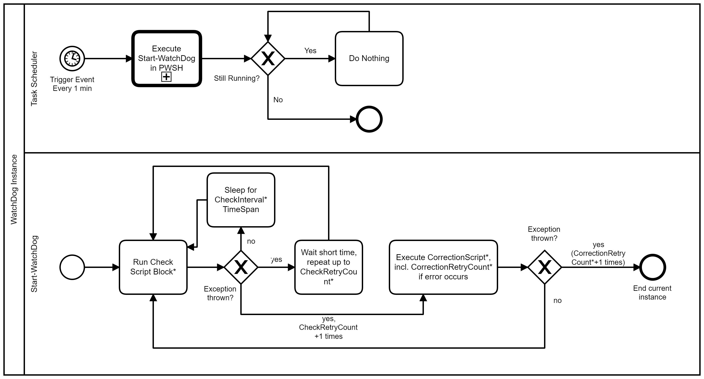
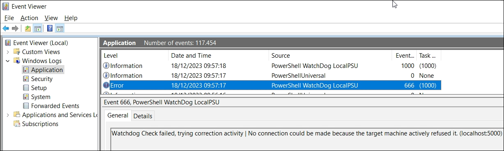

<!--
*** Thanks for checking out the Best-README-Template. If you have a suggestion
*** that would make this better, please fork the repo and create a pull request
*** or simply open an issue with the tag "enhancement".
*** Thanks again! Now go create something AMAZING! :D
***
-->

<!-- PROJECT SHIELDS -->
<!--
*** I'm using markdown "reference style" links for readability.
*** Reference links are enclosed in brackets [ ] instead of parentheses ( ).
*** See the bottom of this document for the declaration of the reference variables
*** for contributors-url, forks-url, etc. This is an optional, concise syntax you may use.
*** https://www.markdownguide.org/basic-syntax/#reference-style-links
-->
[![Contributors][contributors-shield]][contributors-url]
[![Forks][forks-shield]][forks-url]
[![Stargazers][stars-shield]][stars-url]
[![Issues][issues-shield]][issues-url]
[![GPLv3 License][license-shield]][license-url]


<br />
<p align="center">
<!-- PROJECT LOGO
  <a href="https://github.com/Callidus2000/WatchDog">
    
  </a>
-->

  <h3 align="center">PowerShell WatchDog</h3>
This repository contains a set of PowerShell functions designed for implementing a WatchDog system. The WatchDog functions are aimed at monitoring and maintaining the health of specific instances or services by continuously checking predefined conditions and taking corrective actions when necessary.

  <p align="center">
    <br />
    <a href="https://github.com/Callidus2000/WatchDog"><strong>Explore the docs »</strong></a>
    <br />
    <br />
    <a href="https://github.com/Callidus2000/WatchDog/issues">Report Bug</a>
    ·
    <a href="https://github.com/Callidus2000/WatchDog/issues">Request Feature</a>
  </p>
</p>


<!-- TABLE OF CONTENTS -->
<details open="open">
  <summary><h2 style="display: inline-block">Table of Contents</h2></summary>
  <ol>
    <li>
      <a href="#about-the-project">About The Project</a>
      <ul>
        <li><a href="#built-with">Built With</a></li>
      </ul>
    </li>
    <li>
      <a href="#getting-started">Getting Started</a>
      <ul>
        <li><a href="#prerequisites">Prerequisites</a></li>
        <li><a href="#installation">Installation</a></li>
      </ul>
    </li>
    <li><a href="#usage">Usage</a></li>
    <li><a href="#use-cases-or-why-was-the-module-developed">Use-Cases - Why was this module created?</a></li>
    <li><a href="#roadmap">Roadmap</a></li>
    <li><a href="#contributing">Contributing</a></li>
    <li><a href="#license">License</a></li>
    <li><a href="#contact">Contact</a></li>
    <li><a href="#acknowledgements">Acknowledgements</a></li>
  </ol>
</details>


<!-- ABOUT THE PROJECT -->
## About The Project

# PowerShell WatchDog Functions

## Introduction

Welcome to the PowerShell WatchDog Functions repository! 🐾

Whether you need to monitor the availability of a service, the execution of specific scripts, or any other custom conditions, the WatchDog functions empower you to build, configure, and manage WatchDog instances tailored to your specific requirements.

Use these functions to create a proactive and automated monitoring solution, capable of detecting issues, executing corrective actions, and ensuring the seamless operation of your critical processes.

Feel free to explore, contribute, and integrate these functions into your PowerShell projects to enhance the reliability and resilience of your systems.

Happy monitoring with PowerShell WatchDog! 🚀👀

## Key concept and provided functions
The main concept is quite simple: You need some PowerShell code to check if your application is running normally (aka 'check script') and some PowerShell Code which fixes problems (aka 'correction script').
These script blocks are called from a scheduled task. If the check fails (the code throws an error) the fixing code is executed. And everything is logged in the event log.




The key functions included are:

- **Build-WatchDog:** Configures a WatchDog instance by specifying a name, check script, error correction script, check interval, and other parameters.
- **Start-WatchDog:** Runs a WatchDog instance in the current console for testing, continuously monitoring and correcting errors based on configured conditions. Call it directly for testing the built config. After registering the instance this function is called from a scheduled task.
- **Register-WatchDog:** Registers a WatchDog instance by creating an event listener and a scheduled task to execute the Start-WatchDog command.
- **Unregister-WatchDog:** Unregisters a WatchDog instance by removing its event listener and deleting the associated scheduled task.
- **Remove-WatchDog:** Delete the saved instance configuration
- **Get-WatchDogError:** Retrieves the last caught error object

## Errors and how to cope with them
If a check fails (the test was negative), the scriptblock has to throw an error/exception. If (e.g. in a busy environment plagued with timeouts) a check may fail even if the service is alive, the check will be repeated up to 4 times (default of the `Build-WatchDog -CheckRetryCount` parameter). After this the configured correction script is executed (up to `Build-WatchDog -CorrectionRetryCount` times) to fix the error. If the correction script throws an error, too, the currently running script/scheduled task instance is stopped.

If you want to access the last error object (e.g. to include the data from the check error in an correction mail) you can use the function `Get-WatchDogError`.

### Built With

* [PSModuleDevelopment](https://github.com/PowershellFrameworkCollective/PSModuleDevelopment)
* [psframework](https://github.com/PowershellFrameworkCollective/psframework)


<!-- GETTING STARTED -->
## Getting Started
Welcome to the PowerShell WatchDog Functions! This guide will help you get started with implementing a robust monitoring system for your PowerShell environment using WatchDog.

To get a local copy up and running follow these simple steps. 

### Prerequisites
- **PowerShell Version:** 7.x (Core) (If possible get the latest version)  
  Maybe it's working under 5.1, just did not test it
- **Elevated Privileges:** Run PowerShell with administrative privileges to perform certain operations.

### Installation

The releases are published in the Powershell Gallery, therefor it is quite simple:
```powershell
  Install-Module WatchDog -Force -Scope AllUsers
```
It is necessary to install the module in the system context as it is used in the context of the SYSTEM account.

## Usage examples
The examples are built to monitor a local [PowerShell Universal instance](https://ironmansoftware.com/).
Please be aware that those commands have to be issued in an administrative shell.

### Configuring a WatchDog Instance
```powershell
Build-WatchDog -Name "LocalPSU" -Check { 
    if ((Invoke-WebRequest http://localhost:5000/api/v1/alive -ErrorAction stop).Statuscode -ne 200) { throw "Alive status not 200" } 
} -ErrorCorrection { 
    $previousError=Get-WatchDogError |ConvertTo-Json -Depth 2
    Send-MailMessage -SmtpServer smtp.company.com -To support@company.com -Subject "WatchDog service.company.com" -From support@company.com -Body $previousError
    restart-service powershelluniversal
}
```

This stores the configuration for the WatchDog:
- Check if the `alive` API returns a http status of 200
- If this fails the windows service is restarted and the Error details from the check is send by mail

## Starting the WatchDog Instance for testing purposes

```powershell
Start-WatchDog -Name "LocalPSU"
```

## Register the WatchDog Instance for permanent usage

```powershell
Register-WatchDog -Name LocalPSU
```

This creates a scheduled task which runs forever.

## Verifying that everything runs
Take a look at the application event log, the watchdog writes to it.



<!-- ROADMAP -->
## Roadmap
New features will be added if any of my scripts need it ;-)

I cannot guarantee that no breaking change will occur as the development follows my internal DevOps need completely. Likewise I will not insert full documentation of all parameters as I don't have time for this copy&paste. Sorry. But major changes which classify as breaking changes will result in an increment of the major version. See [Changelog](FortigateManager\changelog.md) for information regarding breaking changes.

See the [open issues](https://github.com/Callidus2000/WatchDog/issues) for a list of proposed features (and known issues).

If you need a special function feel free to contribute to the project.

<!-- CONTRIBUTING -->
## Contributing

Contributions are what make the open source community such an amazing place to be learn, inspire, and create. Any contributions you make are **greatly appreciated**. For more details please take a look at the [CONTRIBUTE](docs/CONTRIBUTING.md#Contributing-to-this-repository) document

Short stop:

1. Fork the Project
2. Create your Feature Branch (`git checkout -b feature/AmazingFeature`)
3. Commit your Changes (`git commit -m 'Add some AmazingFeature'`)
4. Push to the Branch (`git push origin feature/AmazingFeature`)
5. Open a Pull Request


<!-- LICENSE -->
## License

Distributed under the GNU GENERAL PUBLIC LICENSE version 3. See `LICENSE.md` for more information.

<!-- CONTACT -->
## Contact

Project Link: [https://github.com/Callidus2000/WatchDog](https://github.com/Callidus2000/WatchDog)

<!-- ACKNOWLEDGEMENTS -->
## Acknowledgements

* [Friedrich Weinmann](https://github.com/FriedrichWeinmann) for his marvelous [PSModuleDevelopment](https://github.com/PowershellFrameworkCollective/PSModuleDevelopment) and [psframework](https://github.com/PowershellFrameworkCollective/psframework)


<!-- MARKDOWN LINKS & IMAGES -->
<!-- https://www.markdownguide.org/basic-syntax/#reference-style-links -->
[contributors-shield]: https://img.shields.io/github/contributors/Callidus2000/WatchDog.svg?style=for-the-badge
[contributors-url]: https://github.com/Callidus2000/WatchDog/graphs/contributors
[forks-shield]: https://img.shields.io/github/forks/Callidus2000/WatchDog.svg?style=for-the-badge
[forks-url]: https://github.com/Callidus2000/WatchDog/network/members
[stars-shield]: https://img.shields.io/github/stars/Callidus2000/WatchDog.svg?style=for-the-badge
[stars-url]: https://github.com/Callidus2000/WatchDog/stargazers
[issues-shield]: https://img.shields.io/github/issues/Callidus2000/WatchDog.svg?style=for-the-badge
[issues-url]: https://github.com/Callidus2000/WatchDog/issues
[license-shield]: https://img.shields.io/github/license/Callidus2000/WatchDog.svg?style=for-the-badge
[license-url]: https://github.com/Callidus2000/WatchDog/blob/master/LICENSE

